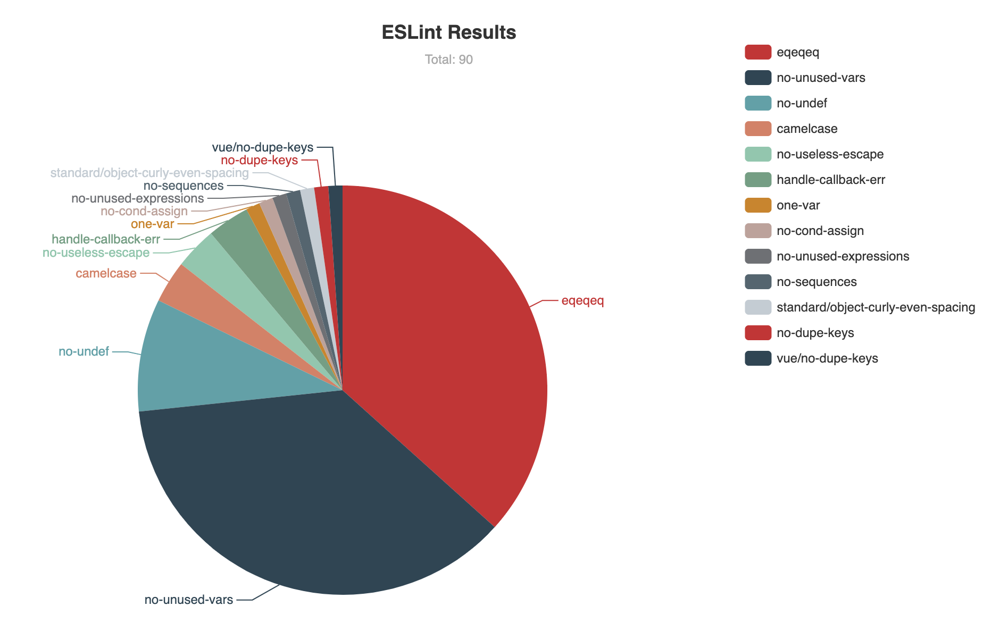

# eslint-formatter-visualize

Easy to visualize and locate to your ESLint errors.
  
<p align="center">
  
</p>

This formatter will collects the ESLint errors and display a chart in a browser tab, the tab will be opened in you favorite browser after the analysis is completed. 

You could also click the sections in the chart to view the error locations, click those locations will automatically open them in VSCode.

## Install

```bash
npm install --save-dev eslint-formatter-overview
```

## Usage

* ESlint:

  ```
  eslint -f visualize src/
  ```

* vue-cli-service

  ```
  vue-cli-service lint --format=visualize
  ```
